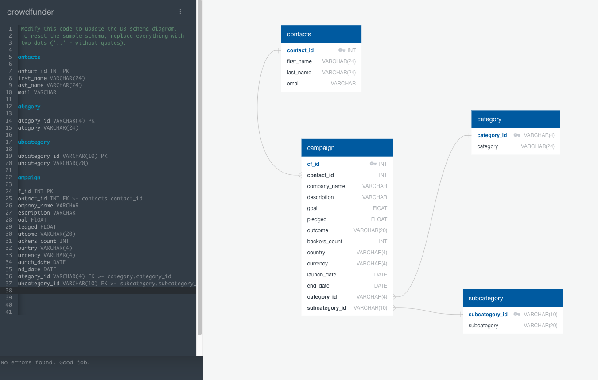

# Crowdfunding_ETL
## Overview
This repository contains a jupyter notebook file that steps through an 'Extract, Transform, Load' procedure from start to finish.
1. 2 .xls files are read into pandas dataframes. i) a list of 1000 crowdfunding projects over the observed period, ii) a list of all project contacts
2. The dataframes are cleaned, restructured and transformed into separate dataframes for each object we want to represent in a database. 
3. The dataframes are written to .csv.
4. An Entity Relationship Diagram is drawn (as below) and the tables are loaded into PostgreSQL. The database schema is at 'crowdfunding_db_scheme.sql'

## Access and usage
clone this repository with the following command:
``
git clone https://github.com/GPN87/Crowdfunding_ETL.git
``